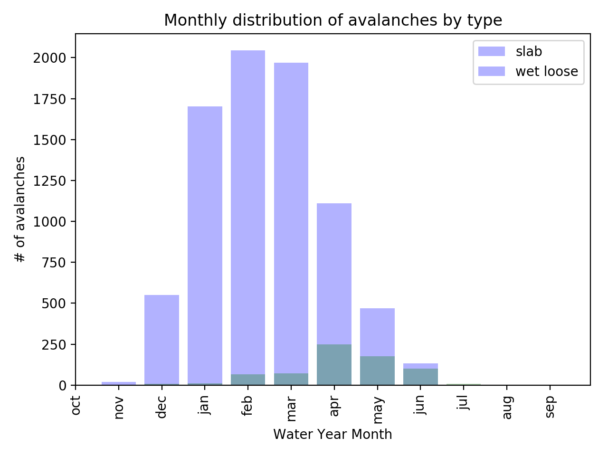
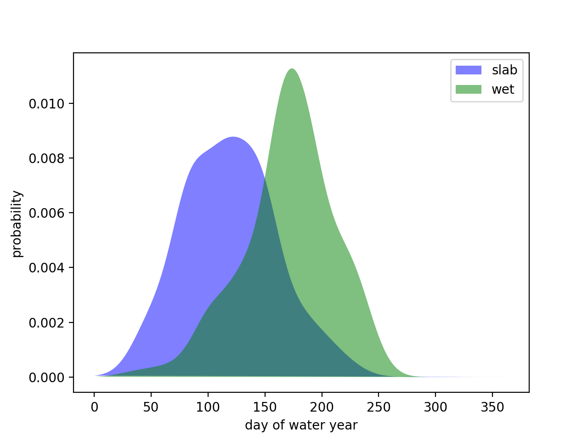

Readme
## Empirical avalanche prediction in Colorado:
#### Can a machine-learning model trained on historical climate, snow, and avalanche data augment prediction of avalanche risk?

__A capstone project for the Galvanize Data Science Immersive.__

_source: Staying Alive in Avalanche Terrain, Bruce Tremper, The Mountaineers Books_

__DISCLAIMER:__ This information is NOT intended to be used as an avalanche risk forecast. This is an empirical study done for scientific purposes. Please refer to the professionals for avalanche forecasts:

http://avalanche.state.co.us

### Data sources:
__Colorado Avalanche Information Center data__ (Colorado Department of Natural Resources)

| 10 Backcountry Zones | Distribution |
|----|----|
| | # |

__D2+ avalanches by backcountry zone:__
- Northern San Juan        2998
- Front Range              1565
- Vail & Summit County     1337
- Aspen                    1210
- Gunnison                 1188
- Sawatch Range             806
- Southern San Juan         585
- Steamboat & Flat Tops     186
- Grand Mesa                155
- Sangre de Cristo           22

avalanche observation data back to 1980:

features: _date, zone, type, size_

__weather data__
SNOTEL sensor network (NRCS, USDA):

_source: NRCS National Water and Climate Center, USDA_

Local Climatalogical Data (commonly airports):

### avalanche trends:

### Model development: training data
|Where            |  Which events | How frequent? |
|:-------------------------:|:-------------------------:|:----:|
|  |  |  |

__Backcountry Zone:__ Aspen, CO
__Destructive size:__ D2 or greater
__Training data:__ 2011-2016 winters (6 seasons)
__Validation data:__ 2017-2018 winter

#### modeling strategy:
__classification model:__
  - binary prediction: 1 if avalanche, 0 if none
  - probability prediction: p(avalanche), evaluated from the sigmoid function:

 - testing two models:
   - Random Forest Classifier
   - Gradient Boosting Classifier
   - (implemented in Scikit-Learn, python 3.5)

__best model: random forest classifier__
 - test accuracy = 0.942
 - test recall = 0.88

### feature engineering
 - use features that control the physical processes that create avalanche conditions:
   - snowfall, wind, temperature
 - literature: features used in avalanche modeling study in Little Cottonwood Canyon, UT
   - _Blatternberger and Fowles, 2016. Treed Avalanche Forecasting: Mitigating Avalanche Danger Utilizing Bayesian Additive Regression Trees. Journal of Forecasting, J. Forecast. 36, 165–180 (2017). DOI: 10.1002/for.2421_

 __probabilities of slab/ wet avalanches:__
  - slab and wet avalanches have overlapping, yet different seasons:

  - relative probability modeled as Gaussian KDE function:

  - each day, calculate p(slab) and p(wet) as function of day-of-water-year

### modeling:
__training:__
 - training data: Aspen Zone, period of record from 2010-2016, CAIC records for D rating > 2 avalanches
 - target: binary label for occurence of any avalanches with D rating > 2
 - separate targets for slab and wet occurence
 - separate models for slab and wet avalanches
   - each model does not include # or probability of other type of avalanche

__testing:__
- test data: 2016 - 2018 period of record
- predict probability of positive class with each model (slab/wet avalanche occured)
- add probabilities: $\Sigma p_{slab}, p_{wet} = p_{avalanche}$
- evaluate model accuracy and recall  
