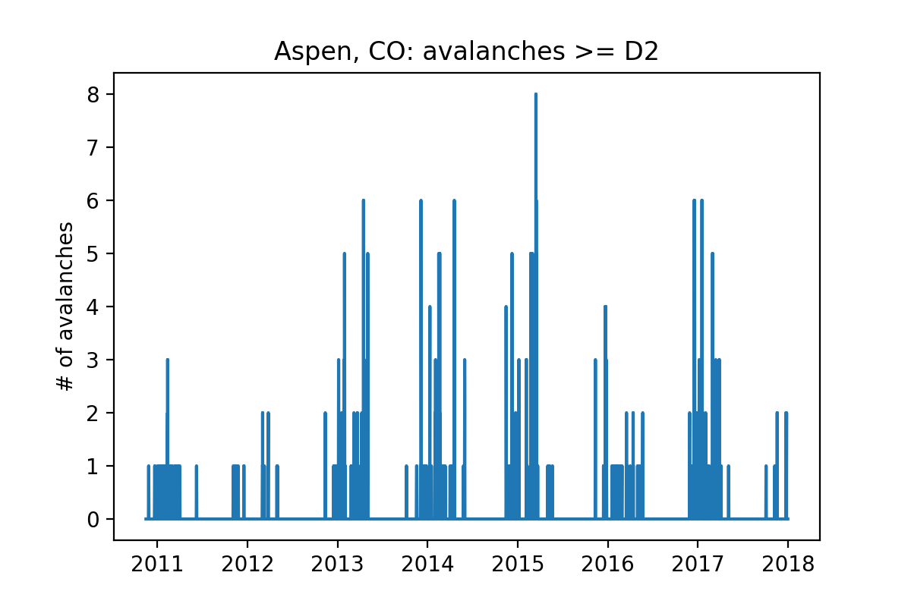

Readme
## Empirical avalanche prediction in Colorado:
#### Can a machine-learning model trained on historical climatic and avalanche data augment prediction of avalanche risk?

__A capstone project for the Galvanize Data Science Immersive.__

_source: Staying Alive in Avalanche Terrain, Bruce Tremper, The Mountaineers Books_

__DISCLAIMER:__ This information is NOT intended to be used as an avalanche risk forecast. This is an empirical study done for scientific purposes. Refer to the professionals for avalache forecasts:

http://avalanche.state.co.us

## Preliminary work (as of April 24, 2018)

### Data:
__Colorado Avalanche Information Center data__

(Colorado Department of Natural Resources)

10 backcountry zones:

avalanche observation data back to 1980:

__weather data__
SNOTEL sensor network (NRCS, USDA):

_source: NRCS National Water and Climate Center, USDA_

Local Climatalogical Data (commonly airports):

### avalanche trends:
__destructive size:__

_this modeling approach will consider avalanches D2 or greater_

__D2+ avalanches by backcountry zone:__
- Northern San Juan        2998
- Front Range              1565
- Vail & Summit County     1337
- Aspen                    1210
- Gunnison                 1188
- Sawatch Range             806
- Southern San Juan         585
- Steamboat & Flat Tops     186
- Grand Mesa                155
- Sangre de Cristo           22

### modeling strategy:

__preliminary study: Aspen zone__

__Data:__  
 - _features:_ wind data from Aspen and Leadville airports, air temperature and precipitation data from Independence Pass SNOTEL station
 - _target:_ Aspen Zone avalanches, # per day (size >= D2)
 - _train and test split:_ June 2016

