## Empirical avalanche prediction in Colorado:
#### Can a machine-learning model trained on historical climate, snow, and avalanche data augment prediction of avalanche risk?

__A capstone project for the Galvanize Data Science Immersive.__

_source: Staying Alive in Avalanche Terrain, Bruce Tremper, The Mountaineers Books_

__DISCLAIMER:__ This information is NOT intended to be used as an avalanche risk forecast. This is an empirical study done for scientific purposes. Please refer to the professionals for avalanche forecasts:

http://avalanche.state.co.us

### Data sources:
__Colorado Avalanche Information Center data__ (Colorado Department of Natural Resources)

| 10 Backcountry Zones | Avalanche observations |
|----|----|
| |  |

avalanche observation data back to 2000:

features: _date, zone, type, size_

__weather data__
SNOTEL sensor network (NRCS, USDA):
 - daily snow height, new snow height, snow-water-equivalent, and max,min,mean air temperature
 - spatial distribution:

_source: NRCS National Water and Climate Center, USDA_

Local Climatalogical Data (commonly airports):
 - peak, sustained wind speed

### Model development: training data
|Where            |  Which events | How frequent? |
|:-------------------------:|:-------------------------:|:----:|
|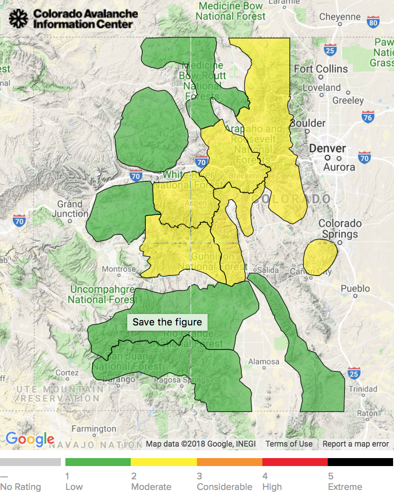  |  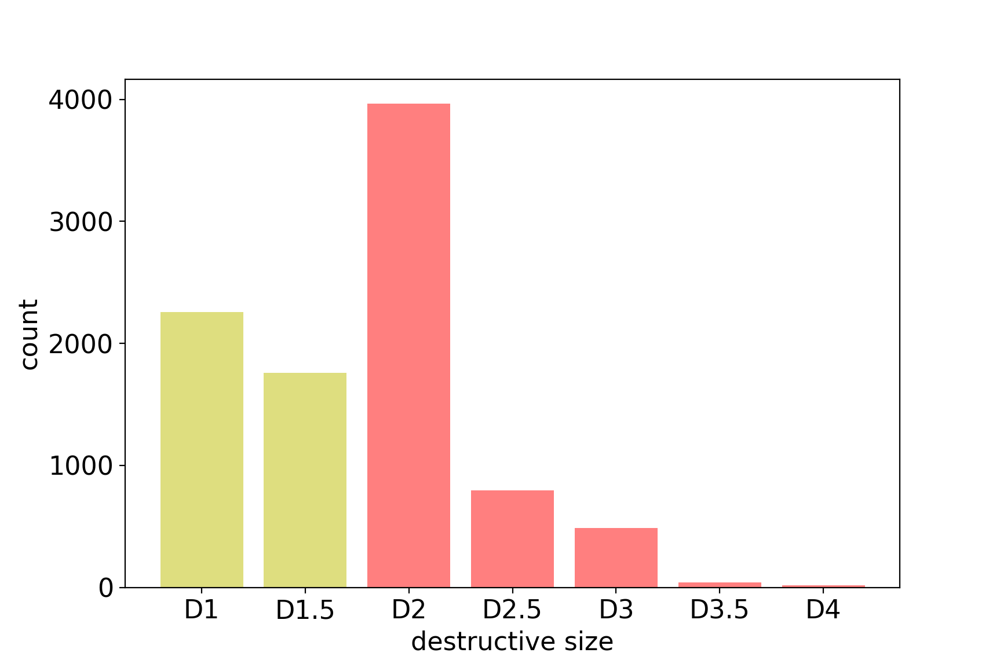| 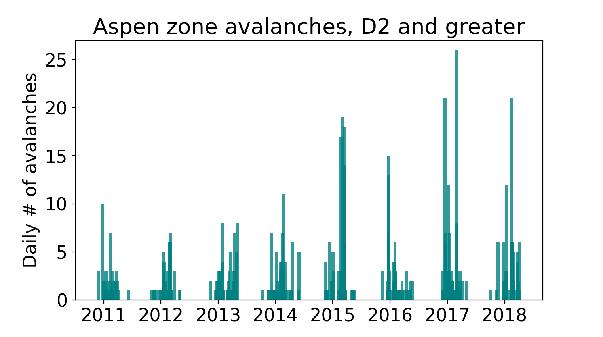 |

__Backcountry Zone:__ Aspen, CO
__Destructive size:__ D2 or greater
__Training data:__ 2011-2016 winters (6 seasons)
__Validation data:__ 2017-2017 winter

#### modeling strategy:
__classification model:__
  - binary prediction: 1 if avalanche, 0 if none
  - probability prediction: p(avalanche), evaluated from the sigmoid function:

 - testing two models:
   - Random Forest Classifier
   - Gradient Boosting Classifier
   - (implemented in Scikit-Learn, python 3.5)

__best model: random forest classifier__
 - test accuracy = 0.942
 - test recall = 0.88

### feature engineering
 - use features that control the physical processes that create avalanche conditions:
   - snowfall, wind, temperature, including time-lagged features
 - literature: features used in avalanche modeling study in Little Cottonwood Canyon, UT
   - _Blatternberger and Fowles, 2016._ (refs at end)

### Feature augmentation: probability of slab/ wet avalanches:
  - slab and wet avalanches have overlapping, yet different seasons:
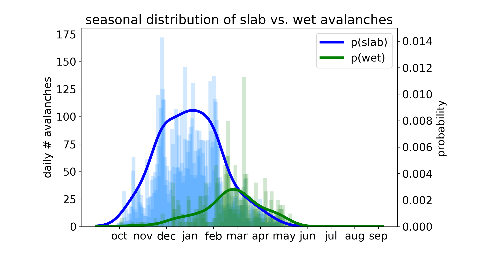

  - relative probability modeled as Gaussian KDE function:
  - p(slab), p(wet) as function of day-of-year
    - _for water year, starting on october 1_
  - $\Sigma (p_{slab}, p_{wet}) = p_{avalanche}$

### ensemble of 2 models:
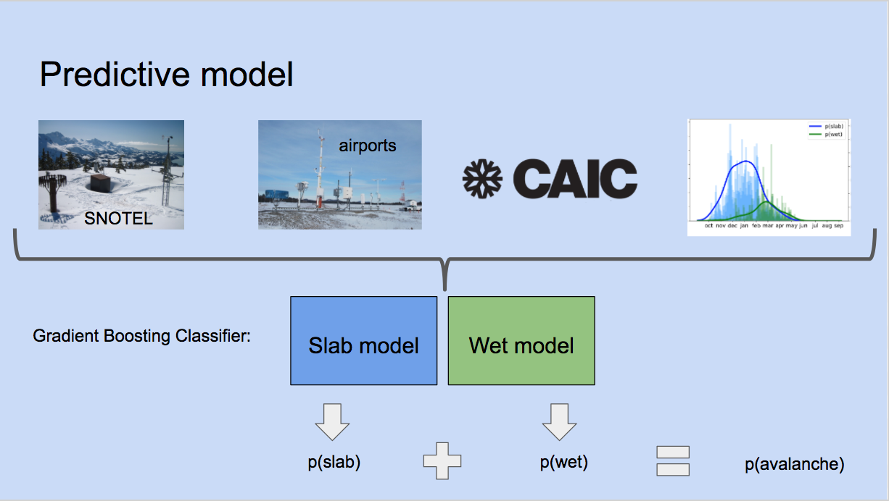

__training:__
 - training data: Aspen Zone, period of record from 2010-2016, CAIC records for D rating > 2 avalanches
 - target: binary label for occurence of any avalanches with D rating > 2
 - separate targets for slab and wet occurence
 - separate models for slab and wet avalanches
   - each model does not include # or probability of other type of avalanche
 - optimize model for recall with 10-fold cross-validation
 - grid search over parameters using Amazon AWS EC2

### validation results: Aspen zone, 2016-2017 season

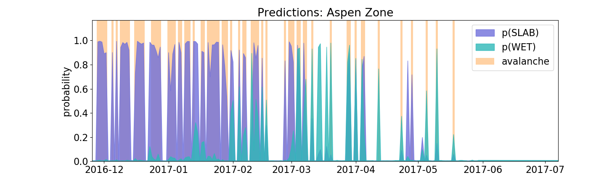

__results figure:__
- days with an avalanche are marked with an orange bar
- predicted probabilities plotted in blue or green (range 0 to 1)
- Each model predicts the probability of a slab or wet avalanche, respectively

__notes:__
- seasonal sense: slab avalanches predicted in winter, wet avalanches in spring
- high recall: all days with true events have a prediction
- lower precision: some false positives in the spring

### ensemble model feature importances:

| slab model | wet model |
|---|---|
| 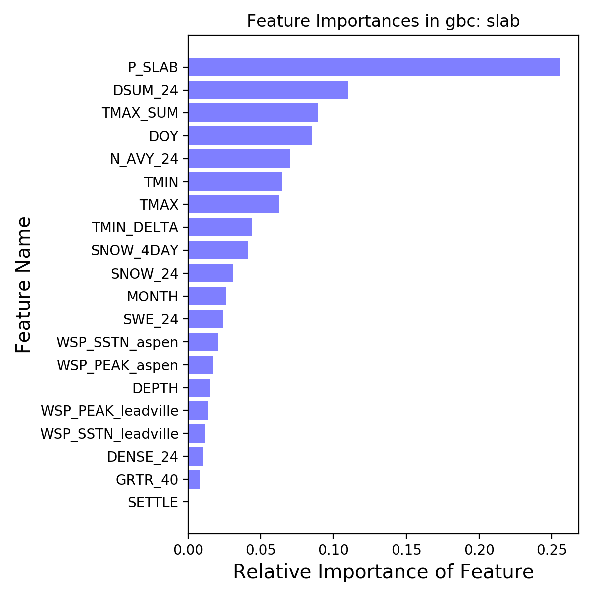 |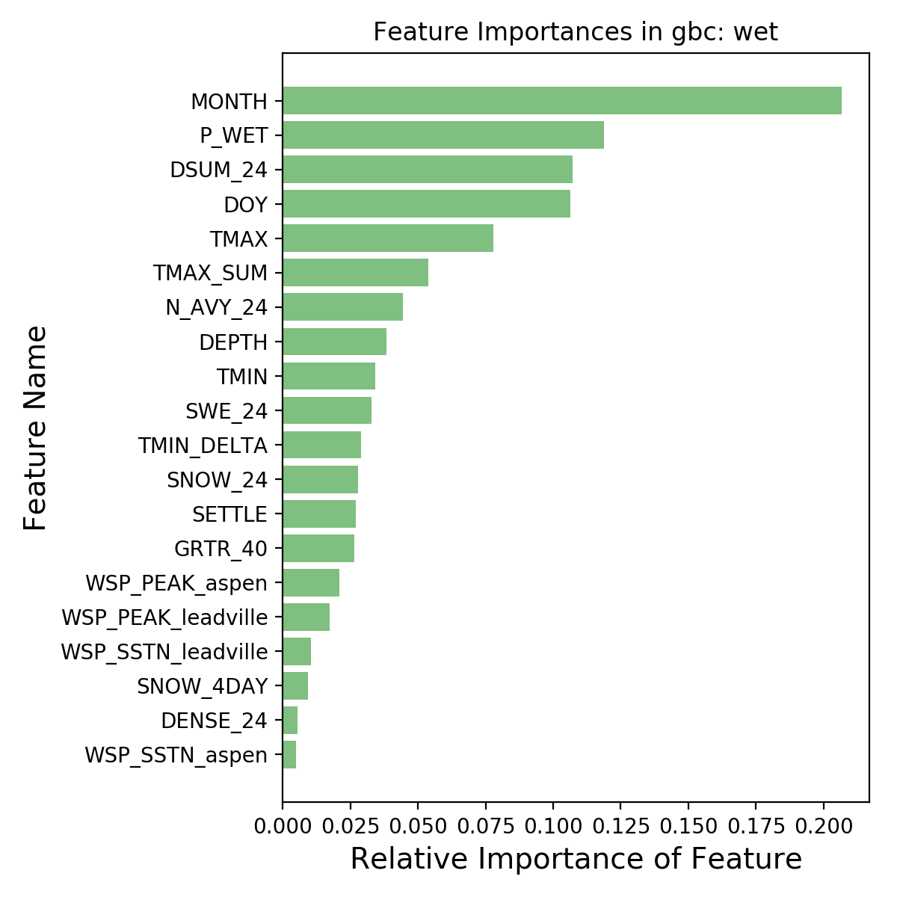 |

__similarities:__
 - same relative order of feature groups:
   1. date, storm cycle features
   2. temperature features
   3. snowpack features
   4. wind speed features

__notable differences that make physical sense:__
 - 'TMAX' important in both (7th, 5th, respectively), but partial dependence plots show:
   - positive relationship in wet model (i.e. p(wet) increases with warm day temps)
   - inverse relationship in slab model (i.e., p(slab) decreases with warm day temps)

| Slab model partial dependence | Wet model partial dependence |
|----|----|
| 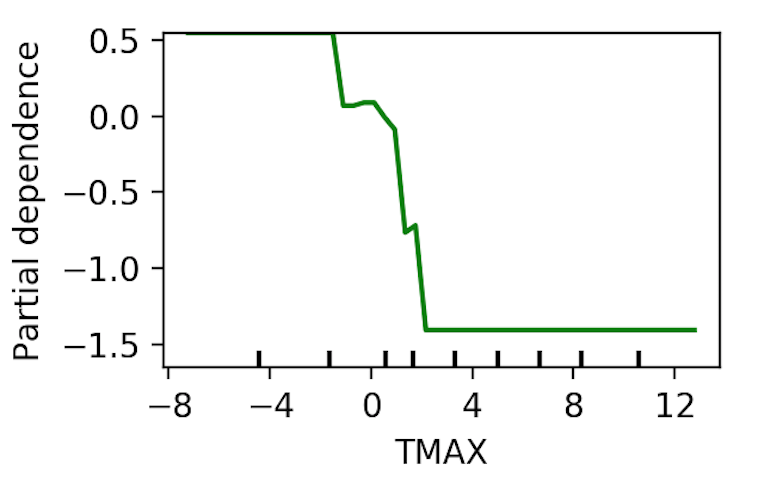 | 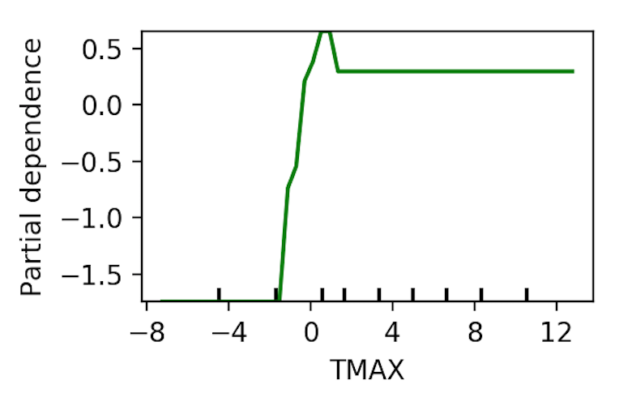 |

 - Snowpack features:
   - 'SNOW_4DAY' important in slab model: 4 day snow loading
   - 'SETTLE' important in wet model: 24 hour snowpack settling

### modeling metrics
__best model results:__

|   | p(slab) | p(wet) | p(slab + wet) |
|-----|-----|-----|-----|
| accuracy | 0.938 | 0.938 | 0.920 |
| precision | 0.851 | 0.476 | 0.860 |
| recall | 0.932 | 0.625 | 0.880 |

__best model parameters:__ (determined by grid search on AWS EC2, optimized for recall)

 - the best parameters differ between models, but generally include:
   - large number of boosting stages
   - constraints on minimum samples and splits at each leaf (regularization)
   - stochastic gradient boosting (each stages uses a random sub-sample of the observations)

 - gradient boosting classifier, slab:
   - {'criterion': 'friedman_mse', 'learning_rate': 0.01, 'loss': 'exponential', 'max_features': 'log2', 'min_samples_leaf': 4, 'min_samples_split': 6, 'n_estimators': 400, 'subsample': 0.8}

 - gradient boosting classifier, wet:
   - {'criterion': 'friedman_mse', 'learning_rate': 0.05, 'loss': 'deviance', 'max_features': 'log2', 'min_samples_leaf': 5, 'min_samples_split': 5, 'n_estimators': 600, 'subsample': 0.4}

__check against naive model (sanity check):__

- guessing 1 every time has bad precision, guessing 0 evert time has horrible recall

|   | naive (ones) | naive (zeros) | gradient boosting |
|-----|-----|-----|-----|
| accuracy | 0.282 | 0.717 | 0.920 |
| precision | 0.288 | 1.0 | 0.860 |
| recall | 0.928 | 0.071 | 0.880 |

### extension: prediction with a neural network
__implementation of a multi-layer-perceptron using Keras__

_brief overview: a multi-layer-perceptron neural network uses a layer of 'hidden' decision gates (a.k.a neurons) to solve a regression or classification problem. All neurons in the network have a weight which is solved for during forward propagation of the problem, then updated with back-propagation of the misfit/mis-classification via gradient descent._

_The hidden neurons are 'hidden' in the sense that the values of their weights are not interpretable with respect to the target values, but their presence gives the network great flexibility in solving non-linear problems._

__preliminary model:__
 - sequential mlp with four hidden dense layers
 - sigmoid activation

__model training (Aspen): binary cross-entropy loss__

| Slab model training | Wet model training |
|----|----|
|  | 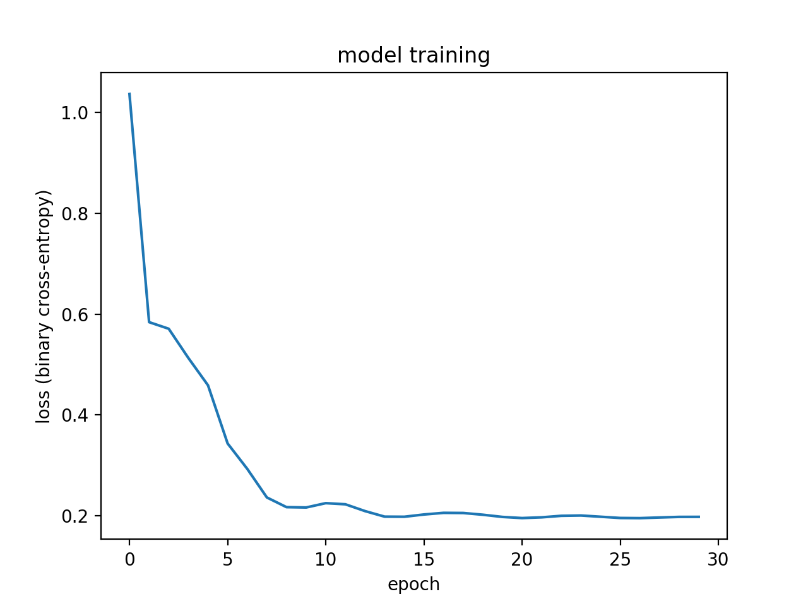 |

- test results:

|   | mlp: slab | gradient boosting: slab | | mlp: wet | gradient boosting: wet|
|-----|-----|-----|----|----|-----|
| accuracy | 0.956 | 0.938 | | 0.825 | 0.938 |
| precision | 0.786 | 0.851 | | 0.130 | 0.476 |
| recall | 0.990 | 0.932 | | 1.00 | 0.625 |

__Discussion__: preliminary implementation of a 4-hidden-layer multi-layer-perceptron neural network indicates that better accuracy and potentially better recall can be acheived, but the neural network is likely over-fitting the training data. Much tuning is needed.

### References:
Data:
 - Colorado Avalanche Information Center, CO Dept of Natural Resources
 - SNOTEL, Natural Resource Conservation Service, USDA
Local Climatological Data, National Climatic Data Center, NOAA

Research:
 - Blatternberger and Fowles, 2016. Treed Avalanche Forecasting: Mitigating Avalanche Danger Utilizing Bayesian Additive Regression Trees. Journal of Forecasting, J. Forecast. 36, 165–180 (2017). DOI: 10.1002/for.2421

Images:
 - opening image: Staying Alive in Avalanche Terrain, Bruce Tremper, The Mountaineers Books
- sensor images: NRCS, NOAA
- slab example: The Avalanche Review, VOL. 29, NO. 3, FEBRUARY
- wet slide example:  Colorado Avalanche Information Center
- multi-layer-perceptron example: https://github.com/ankonzoid/NN-from-scratch
- closing shot: Annie Hancock in Rocky Mountain National Park, CO. photo: Drew Thayer

__directory structure:__
~~~
├── README.md
├── data
│   ├── data-LCD
│   │   ├── raw LCD airport data (.csv)
│   ├── data-caic
│   │   ├── raw CAIC data (.csv)
│   ├── data-snotel
│   │   ├── raw snotel files (.csv)
│   ├── data-caic.db
│   ├── data-aspen.db
│   ├── data-nsj.db
├── data_sources.md
├── development
├── figs
│   ├── all figures
├── model_features.md
├── modeling_notes.md
└── src
    ├── source code: python scripts, .pkl files
~~~
